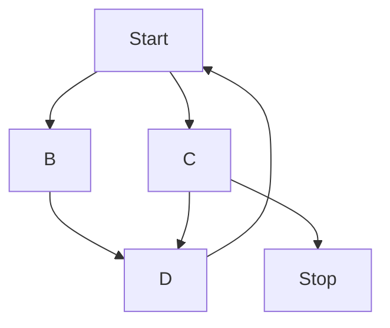
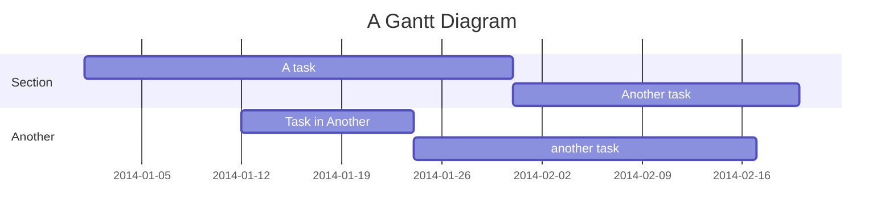

# Best Practices
General notes, tips, and tricks for writing better code and building better projects.

**Quick Links:**\
[Project Folder Structure](#project-folder-structure)\
[Python](#python)\
[Visual Studio Code](#visual-studio-code)\
[Markdown](#github-flavored-markdown)\
[Version Numbering](#version-numbering)\
[Powershell]()

# Project Folder Structure
stuff about folder layout WIP
```
├ project_folder
├───docs
├───media
├───scripts
├───src
│   └───assets
└───test
```

# Python
official python style guide - [PEP8](https://peps.python.org/pep-0008/)

## Virtual Environments
It's a good idea to maintain a virtual environment for each project.
This helps keep track of exactly what libraries are needed for a project to work properly.
That information can then be shared with other users via the requirements.txt and freeze.txt files.

# Visual Studio Code 
This is my primary development tool WIP
### Extensions
### Theme
### Layout
### Settings

# GitHub-Flavored Markdown
Markdown is an extremely useful and flexible text format. 
It can be used to render clean and concise documentation using features described in the github-flavored markdown 
[guide](https://docs.github.com/en/get-started/writing-on-github) 
and [cheat sheet](https://github.com/adam-p/markdown-here/wiki/Markdown-Cheatsheet).

## Code Blocks

**Python-flavored code block**
```python
# triple back-ticks (```) make a code block
# syntax highlight defined in top line 

import pandas as pd
df = pd.read_csv('file.csv')
```

**Block quote**
>long string of text, will auto wrap when rendered. kinda nice to have if something goes on longer that you thought but you still want it to be readable.

**Formula code block**
based on [KaTeX](https://katex.org/docs/supported.html)
```math
\left( \sum_{k=1}^n a_k b_k \right)^2 \leq \left( \sum_{k=1}^n a_k^2 \right) \left( \sum_{k=1}^n b_k^2 \right)
```

```math
m_{total} = \prod_{i=1}^n (1-m_i)
```

**Inline formula symbols** \

Some text. Now a formula:
$a_k = b^n + c$ with more text \
And some more text on a new line.

More examples:
*  $a_{long}$ = long subscript
*  $b^k$ = superscript
*  $\mu$ = symbol mu

without bullets, in a block quote:
>$\overline{AB}$ = overline \
$\dot{m}$ = dot


## Diagrams
Can be rendered with the the [mermaid](https://mermaid.js.org/) diagram format. 
Vscode might need an extension to render these, I had luck with 
[this](https://marketplace.visualstudio.com/items?itemName=bierner.markdown-mermaid) 
one which is available for free. Mermaid diagrams should be natively supported by 
[GitHub](https://docs.github.com/en/get-started/writing-on-github/working-with-advanced-formatting/creating-diagrams)
as of 2022.
Examples below, and more, are shown in the official 
[docs](https://mermaid.js.org/intro/syntax-reference.html).


**Flow Chart**


<!-- **Pie Chart**


**Gantt Chart**



# Version Numbering
There are generally 2 schools of thought for versioning:
* Semantic Versioning (SemVer) - good for public libraries with an API where you want to know if a new version will be backward compatible with your existing code. See detailed descriptions [here](https://semver.org/) and [here](https://www.geeksforgeeks.org/introduction-semantic-versioning/)
* Calendar Versioning (CalVer) - good for application releases where the code is not used by a third party and the date of the release is more important than the changes to compatibility. Typically formatted as YYYY.MM.DD.PATCH

There are pros and cons to each. Whatever you choose, it is important to pick something that makes sense and stay consistent.


# Powershell
Powershell (only applies to windows machines) is the default terminal for VScode. 
It can be used to execute simple scripts to automate processes that use the command line such as 
setting up a [virtual environment](#virtual-environments) or building a compiled version of your code.